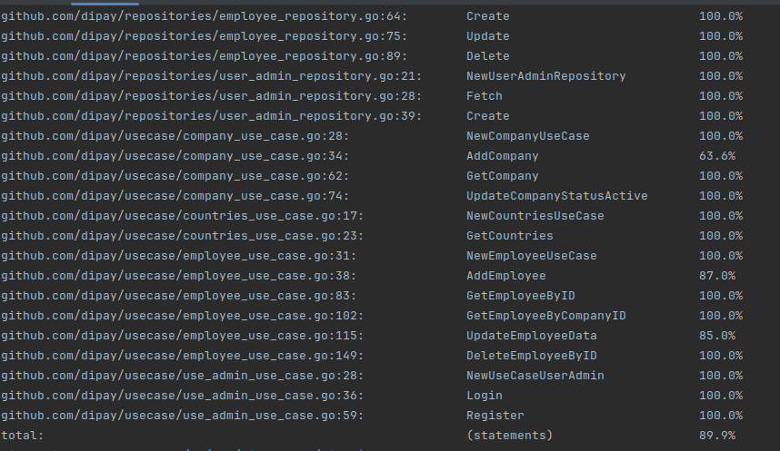
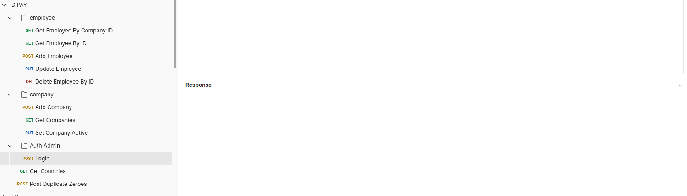

# Backend Developer Assignment

## Requirements

To run this project you need to have the following installed:

1. [Go](https://golang.org/doc/install) version 1.20
2. Install Mongo DB [mongodb](https://www.mongodb.com/docs/manual/installation/#mongodb-installation-tutorials) on local machine
3. [GNU Make](https://www.gnu.org/software/make/)
4. [oapi-codegen](https://github.com/deepmap/oapi-codegen)
5. [Docker](https://docs.docker.com/get-docker/) version 20
6. [Docker Compose](https://docs.docker.com/compose/install/) version 1.29
   Install the latest version with:
    ```
    go install github.com/deepmap/oapi-codegen/cmd/oapi-codegen@latest
    ```
6. [mock](https://github.com/golang/mock)

    Install the latest version with:
    ```
    go install github.com/golang/mock/mockgen@latest
    ```

Prerequisite

1. Update .env for connection with your local environment

   Install the latest version with:
    ```
    HTTP_ADDRESS: <localhost env>
    DATABASE_URL: <localhost env>
    DATABASE_NAME: <localdatabase name>
    ```

How To Start:

Service [Application]:
1. Run Service with Binary
    ```
      make all start-binary
    ```
   service will Run with port as define on Prerequisite


2. Run with Non Binary
    ```
      make all start-non-binary 
    ```
   service will Run with port as define on Prerequisite

Service [Send Email]:
1. Run Service with Binary
    ```
      cd dipayemail
      go mod tidy
      go mod vendor
    ```
2. Run service on docker with kafka
    ```
      cd dipayemail
      docker-compose up -d 
    ```

Unit Test:
1. Run Unit test
   ```
      make test
   ```
2. Run Unit Test + with coverage 
    ```
      make coverage
    ```
   

### Default Port
| Folder              | Port                                           |
|---------------------|------------------------------------------------|
| Service Application | 7000                                           |
| Service Email       | 6000                                           |


### The Complete Project Folder Structure
```
.
├── dipay/
│   ├── api/
│   │   └── api.gen.go
│   ├── bootstrap/
│   │   └── boostrap.go
│   ├── cmd/
│   │   ├── halders/
│   │   │   ├── company_hanlers.go
│   │   │   ├── countries_hanlder.go
│   │   │   ├── duplicate_zero_hanlder.go
│   │   │   ├── employee_hanlder.go
│   │   │   ├── hanlers.go
│   │   │   └── user_admin_hanlder.go
│   │   ├── main.go
│   │   └── dipay.yml
│   ├── commons/
│   │   ├── convert.go
│   │   ├── file_reader.go
│   │   └── response_wrapper.go
│   ├── controller/
│   │   ├── company_controller.go
│   │   ├── countries_controller.go
│   │   ├── duplicate_zero_controller.go
│   │   ├── employee_controller.go
│   │   └── user_admin_controller.go
│   ├── db/
│   │   ├── migrations/
│   │   │   └── 0001_initial_dipay.go
│   │   └── migration.go
│   ├── internal/
│   │   ├── db/
│   │   │   └── mongondb.go
│   │   ├── env/
│   │   │   └── env.go
│   │   ├── jwt/
│   │   │   └── jwt.go
│   │   ├── middleware/
│   │   │   ├── group.go
│   │   │   └── middleware.go
│   │   ├── validations/
│   │   │   └── validations.go
│   │   ├── constants.go
│   │   ├── error_wrapper.go
│   │   ├── job_title.go
│   │   └── util.go
│   ├── model/
│   │   ├── companies_model.go
│   │   ├── employee_model.go
│   │   └── user_admin_model.go
│   ├── pkg/
│   │   └── httclient/
│   │       └── http_client.go
│   ├── readme
│   ├── repositories/
│   │   ├── company_repository.go
│   │   ├── countries_repository.go
│   │   ├── employee_repository.go
│   │   ├── struct.go
│   │   └── user_admin_repository.go
│   └── usecase/
│       ├── company_use_case.go
│       ├── countries_use_case.go
│       ├── employee_use_case.go
│       └── user_admin_use_case.go
├── .env
├── go.mod
├── go.sum
├── private_key.pem
├── public_key.pem
└── DIPAY.postman_collection.json
```


### Explain Structure file
| Folder     | Description                                    | Example |
|------------|------------------------------------------------|---------|
| Api        | Generator swagger api contract                 |         |
| bootstrap  | initial all depend injection for service       |         |
| cmd        | main application for project                   |         |
| commons    | code common function used                      |         |
| controller | verify all request server http                 |         |
| db         | for engine migration database                  |         |
| internal   | all related dependencies liblary using service |         |
| model      | define field for table / document              |         |
| pkg        | define http to extnal service                  |         |
| repository | get data from client or database redis etc     |         |
| usecase    | for put logic api                              |         |


Flow Rule Application 

Note:
0. once we needed isolate contract, if craete new endpoint add firstly on dipay.yml 
1.  ```make all``` on script we will  execute migration table: admin, companies, employees
   - admins
     - email will set **UNIQUE**
   - companies
     - company_id + email will set constraints **UNIQUE**
   - employees
     - telephone_number will set  **UNIQUE**
   
2. Login
   - once data not found on database, service will create new user on table/document admins
3. JWT 
   - since we using JWT RSA so make sure 
     - private_key.pem +  public_key.pem
     
   but i already put example so for development can use it
4. I already put postman collection as well ```DIPAY.postman_collection.json```




Thank you for considering my application for the Backend Developer position. I'm excited about the opportunity to join your team.

Cheers Happy Coding :) 

Aplicant

| Name          | Email                 |
|---------------|-----------------------|
| Rifky Rachman |rifky.rachman@gmail.com|